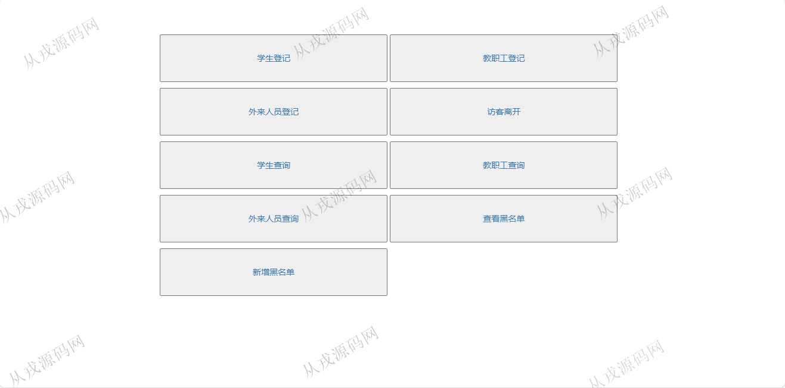
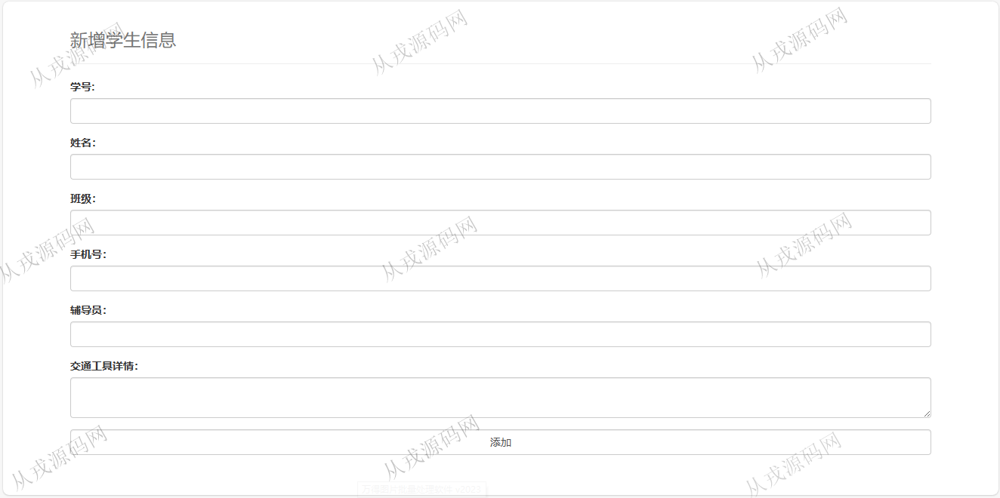
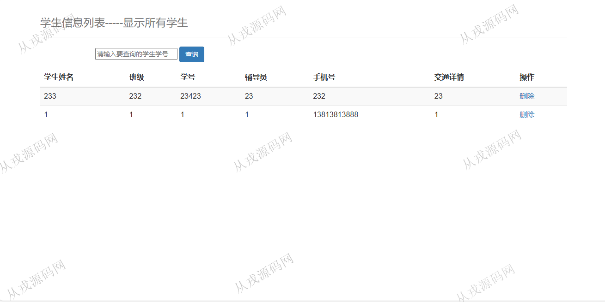
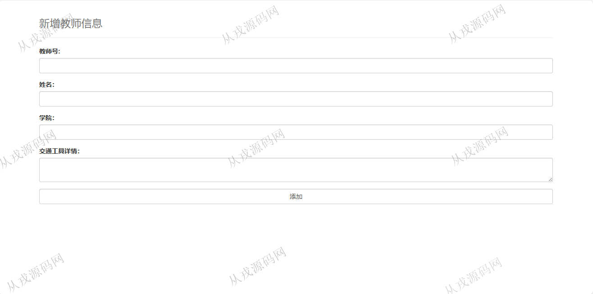
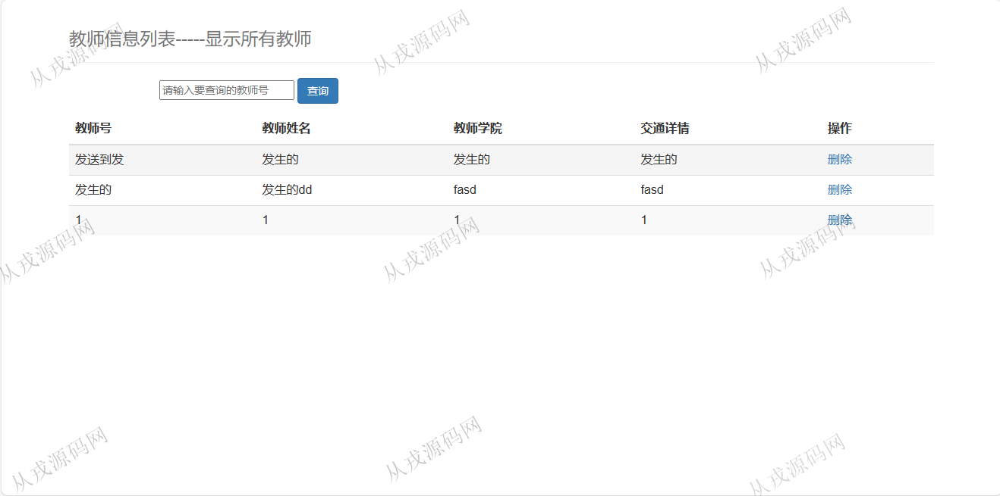
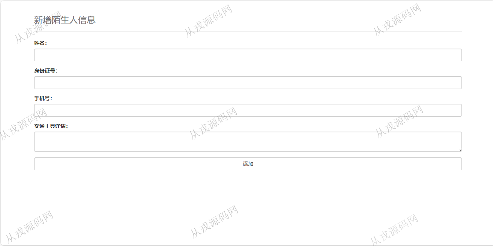
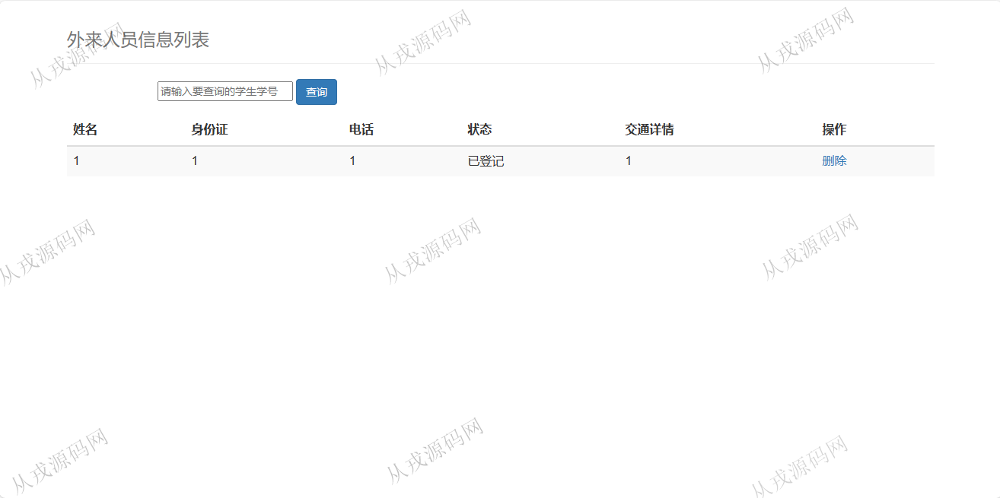

<h1 align="center">104.疫情学校信息登记管理系统</h1>

 获取sql文件 QQ: 386869957 QQ群: 377586148 

 [推荐站点: 从戎源码网](https://armycodes.com/) 

## 简介

> 本代码来源于网络,仅供学习参考使用!
>
> 提供1.远程部署/2.修改代码/3.设计文档指导/4.框架代码讲解等服务
> 
> 访问地址：http://localhost:8080/
>

## 项目介绍
基于ssm的疫情学校信息登记管理系统：这个项目主打一个简单，前端 jsp、jquery、bootstrap，后端 maven、springmvc、spring、mybatis；集成学生登记、教职工登记、外来人员登记和相关查询等功能于一体的系统。

## 功能介绍

- 学生登记：学生信息录入登记，学生信息查询，删除，模糊查询
- 教职工登记：教职工信息录入登记，教职工信息查询，删除，模糊查询
- 外来人员登记：外来人员信息录入，外来人员查询，删除，模糊查询
- 黑名单：新增黑名单，查看黑名单，删除

## 环境

- <b>IntelliJ IDEA 2021.3</b>

- <b>Mysql 5.7.26</b>

- <b>Tomcat 7.0.73</b>

- <b>JDK 1.8</b>

## 运行截图

